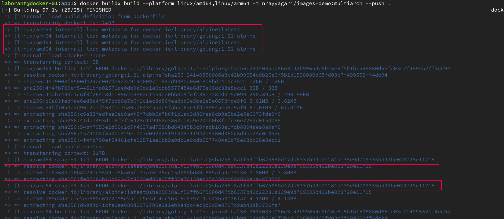
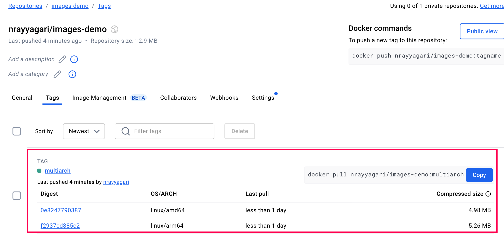
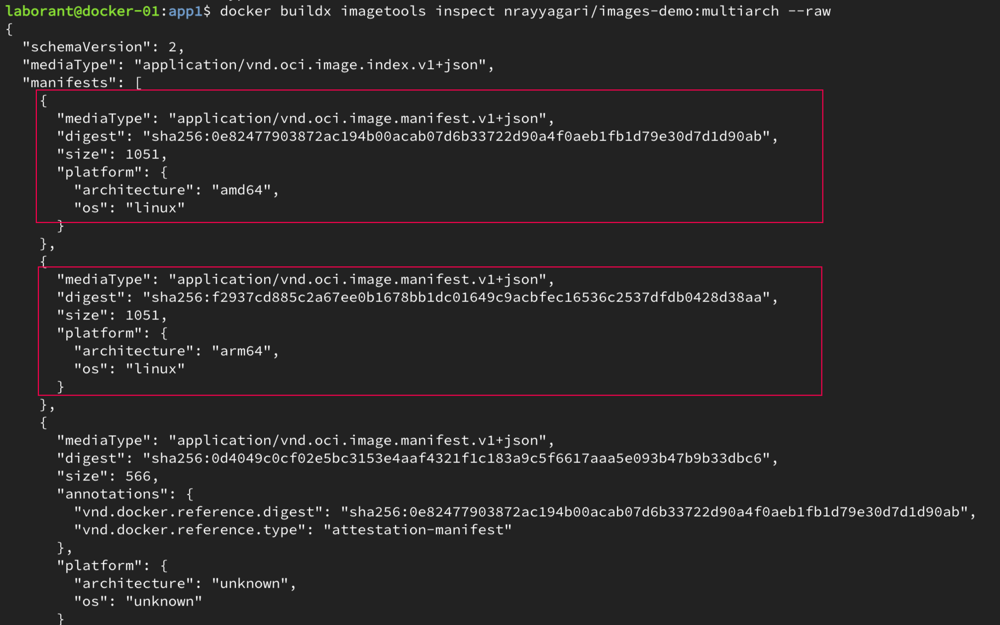
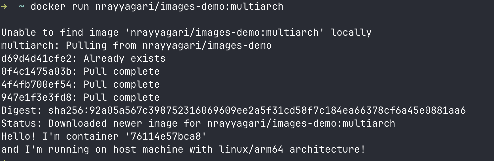
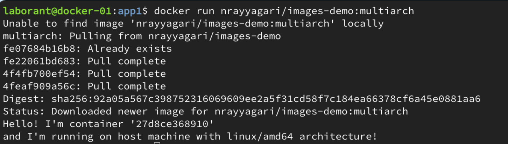

# Multi-Architecture Docker Images

## 1. Introduction: Multi-Architecture Problem

Applications today need to run on different processor architectures (x86-64 servers, ARM-based AWS Graviton, Apple M1 etc). Traditional single-architecture Docker images cause compatibility issues and performance problems when run on host machines with different architectures.


## 2. Demonstrating the Single-Architecture Problem

Refer `Dockerfile` and `main.go` in the `app1` directory for the sample application.

Build a single-architecture image from the project root (assuming you are on an x86_64 build machine, this will be an amd64 image):

```bash
docker build -t myapp:x86_64 app1/
```

Run the image:

```bash
docker run myapp:x86_64
```

When run on ARM based system, 

Output shows: `WARNING: The requested image's platform (linux/amd64) does not match the detected host platform (linux/arm64/v8)`


## 3. Solution: Building Multi-Architecture Images

### Prerequisites: Setting Up Docker Buildx

Check existing builders:

```bash
docker buildx ls
```

Create a new multi-architecture builder using docker-container driver:

```bash
docker buildx create --name multiarch-builder --driver docker-container --use
```

Bootstrap the builder:

```bash
docker buildx inspect --bootstrap
```

### The Multi-Arch Build Command

```bash
docker buildx build --platform linux/amd64,linux/arm64 -t nrayyagari/images-demo:multiarch --push .
```

Building the images for two architectures at a time can be seen below



## 4. Docker Registry Structure Visualization

```
Registry: nrayyagari/images-demo:multiarch
├── Manifest List (sha256:1a2b3c4d...)     ← Single entry point
│   ├── References → AMD64 Image (sha256:5e6f7g8h...)
│   └── References → ARM64 Image (sha256:9i0j1k2l...)
├── AMD64 Image (sha256:5e6f7g8h...)        ← Separate complete image
└── ARM64 Image (sha256:9i0j1k2l...)        ← Separate complete image
```



**Note: There is a single Docker Image tag with two digests, one for each architecture.**

## 5. Understanding Docker Manifests and Digests

Inspect the multi-architecture image:

```bash
docker buildx imagetools inspect nrayyagari/images-demo:multiarch
```



## 6. The Magic: Automatic Architecture Selection

#### What Happens When You Run

```bash
docker run nrayyagari/images-demo:multiarch
```
On ARM based system



On x86 based system



#### What's Happening Under the Hood
1. Docker fetches the single manifest list of the multiarch image
2. Compares available architectures with host system
3. Automatically selects appropriate architecture-specific image
4. Downloads only the relevant layers

## 6. Limitations of Multi-Architecture Docker Images

### Build Challenges:
- Longer build times and increased resource usage
- Complex CI/CD pipelines requiring architecture-specific testing
- Higher registry storage costs due to multiple image variants

### Technical Limitations:
- Not feasible for applications with architecture-specific dependencies:
  
  **Proprietary Binaries:**
  ```dockerfile
  # Example: Applications using proprietary x86-only libraries
  FROM ubuntu:20.04
  COPY proprietary-x86-lib.so /usr/lib/
  RUN ./x86-only-installer.bin
  ```

- Cross-compilation issues with certain languages/frameworks
- Legacy applications with x86-only dependencies cannot be multi-arch

## 7. Key Takeaways

### The Problem
- Single-arch images cause compatibility and performance issues
- Emulation works but has significant overhead

### The Solution
- Multi-arch images package multiple architectures in one reference
- Manifest lists enable automatic architecture selection

### The Implementation
- Docker Buildx makes building multi-arch images straightforward
- Registry stores multiple images with single manifest list coordinator
- Automatic selection happens transparently

### The Benefits
- Seamless cross-platform deployment
- Single image reference for developers
- Future-proofing for new architectures

### Limitations
- Build times and resource usage increase
- Registry storage costs rise
- Not feasible for applications with architecture-specific dependencies
- Or when binary compatibility with other architectures is not available

## 7. Common Issues and Troubleshooting

- **Error: "multiple platforms feature is currently not supported"**: Ensure you're using docker-container driver
- **Error: "push access denied"**: Make sure you're logged in with `docker login`
- **Error: "failed to solve: rpc error"**: Try recreating the buildx builder
